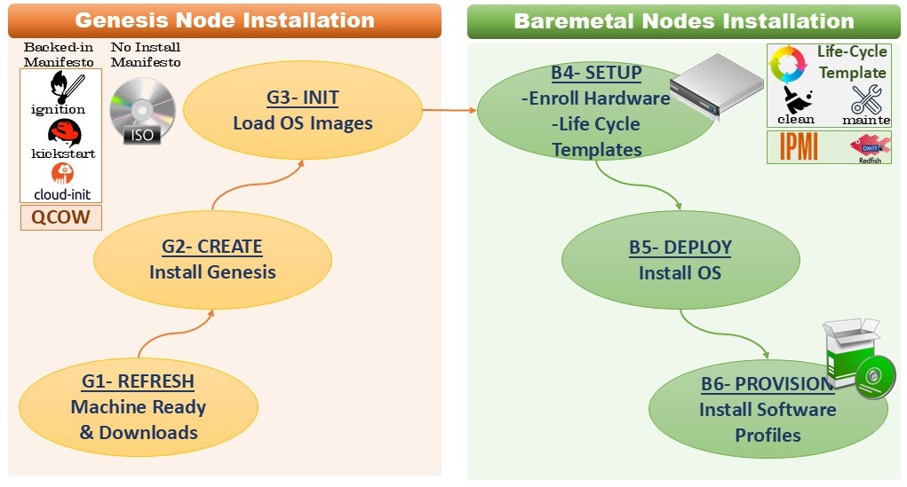
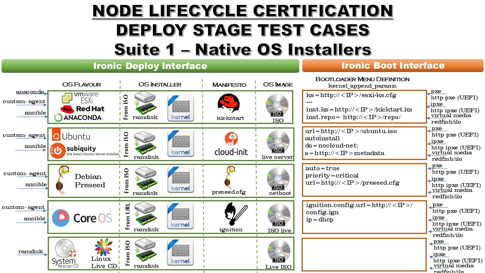
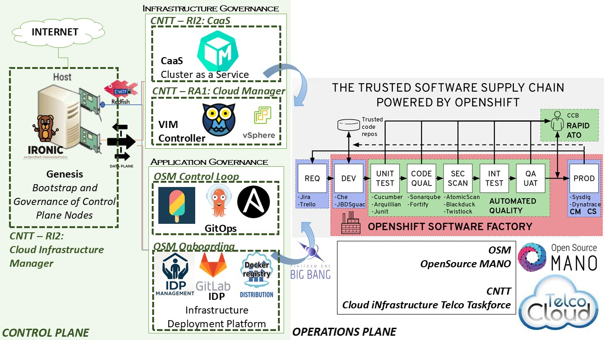
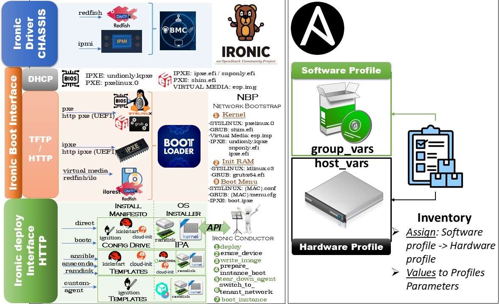

# Genesis Node Project
## 1.- Goals
#### 1.1.- Vision
- **PoC (Proof of Concept)**: adopt Telco Cloud Anuket  [standards](https://cntt.readthedocs.io/en/stable-kali/common/chapter00.html) and [tooling](https://ec.europa.eu/newsroom/repository/document/2025-9/TelcoCloudReferenceArchitecture_v7_L8XM9LekTSnxgxb9NgJkBBifw_113237.pdf) for Software Factories management.

#### 1.2.- Mision
- **Bootstrap Data-Center Control Plane**, from scratch to install or restore at any moment (just as AT&T Airship Genesis does, but based on components with large communities behind).
- **Hardware Certification Test Suites and Resulting Configuration Blueprints**, automation requires a single control API (provided by Ironic in this case), hardware lifecycle need to be fully integrated into this API.

## 2.- Installation
#### 2.1.- Supported Platforms
- Ubuntu 24.04 Noble fresh installation
- OpenStack > 2026.1... for registry based image deployments

#### 2.2.- Steps
- 1) Clone Project
- 2) Use genesisCli menu to run steps of the Genesis Node Lifecycle
- 3) Configurations:
    + 3.1.- hosts/{environment} => Hardware & Software Profiles of your machines (becareful defining them well, in hosts/test examples of each deployment use case)
    + 3.2.- hosts/target        => Genesis Node Customizations, including the list of operating systems you want to deploy and the type of image (os native installer or cloud installer):
     	- __Image Types:__ *os installer:* iso ; *cloud installer:* partition(qcow/img)/wholedisk(raw)
		- __Install manifestos:__ {cloud-init/kickstart/ignition} depending on the OS installer used.	
		- __Install manifestos Provisioning:__ {backed-in/config-drive/tftp-http}.
		
#### 2.3.- Genesis Node Life Cycle

## 3.- Use Cases
#### 3.1.- Installation Scenarios
- **Genesis with Internet**... download OpenStack components and linux distros images and save it locally.
- **Genesis Airgap**... tarball Genesis project with local repository to deploy in isolated environments.
... Genesis Airgap not tested, eventually tools such [Hauler](https://ranchergovernment.com/blog/simplifying-the-airgap-experience-with-rancher-government-hauler) or [Zarf](https://zarf.dev/) should be included. Prefered CentOS/RHEL over Ubuntu since airgap repos easier to create from ISO.
- **Ansible Execution Environment** Compilation... layout is there for packaging Genesis into a Container in the future. Eventually integrate [Kolla-Ansible](https://docs.openstack.org/kolla-ansible/latest/reference/deployment-and-bootstrapping/bifrost.html) tooling for that.

#### 3.2.- Use Case 1: Hardware LifeCycle Certification Test Cases
In order to insert a node into undercloud automation:
+ 1- **LifeCycle Stages Certification:** verify that all lifecycle stages can be properly manage by Ironic.
+ 2- **Use Bluprints**: Create Configuration Blueprints for each Baremetal Node type of your infrastructure. 
+ 3- **Keep Testing Environment** to troubleshoot different situations in a controlled environment.

#### 3.3.- Use Case 2: Control Plane Bootstrap (Proof of Concept Scheme)

## 4.- Ironic and Ansible usage in Genesis Node
#### 4.1 - Deploy Stage Details
- **Deploy Stage Setup**: this node life cycle stage establish how do you inject OS to instance, based on two interfaces:
 + __Boot Interface:__ depends on hardware particulars of the machine
 + __Deploy Interface:__ dependes on tupe of os installer native os/cloud.

#### 4.2 - Node Life Cycle: The Ironic State Machine
+ **Enroll = Setup each Node LifeCycle Stage** based on templates, trend is to rely on out-of-band BMC definitions as much as possible when new DMTF specifications allow it. Just the deploy stage has a big part in-band (the boot/deploy intefaces tat define PXE particulars).
[Node States Diagram](https://docs.openstack.org/ironic/latest/user/states.html) 

## 5.- OpenStack Modules supported by standalone Ironic, but not used by installer yet.
- **Horizon plugin**... User Interface.
- **Keystone**... Authentication, Authorization, Accounting (next release will include TLS certificates handling).
- **Prometheus**... Stadistics (will be included into Ironic next release).
- **IPA Hardware Inspector**... to build hardware profiles through machine inspection (will be included into Ironic next release).

# Author
Cesar Delgado